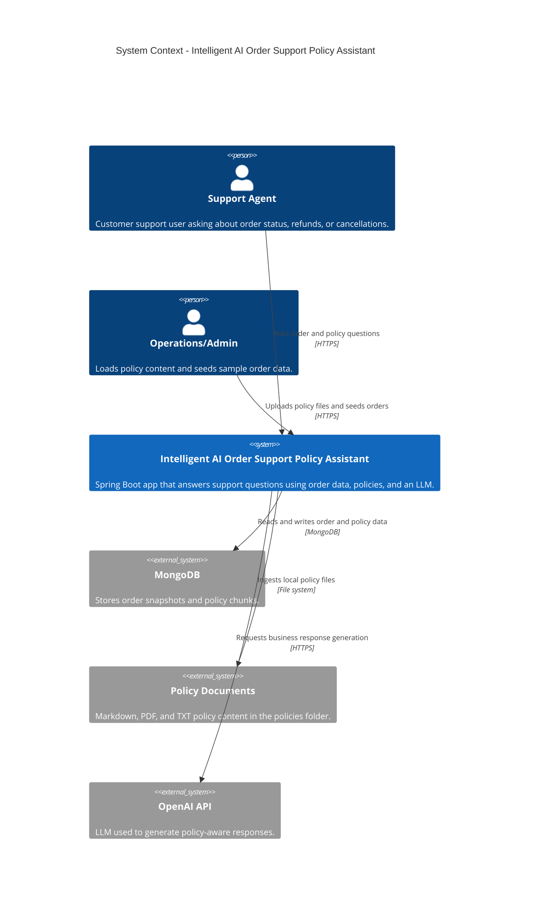
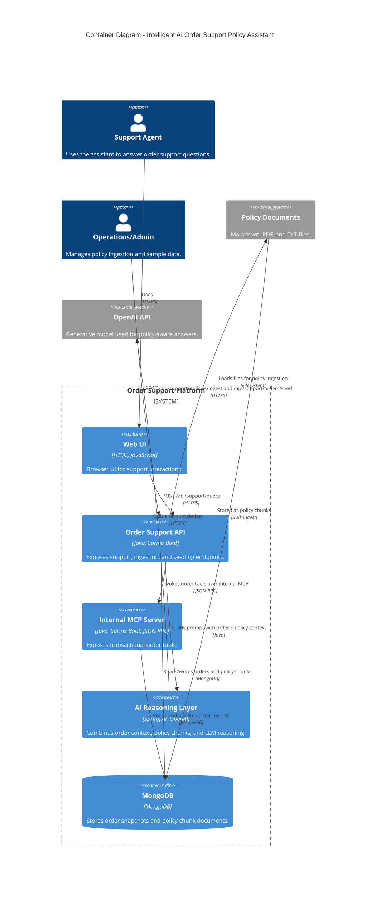
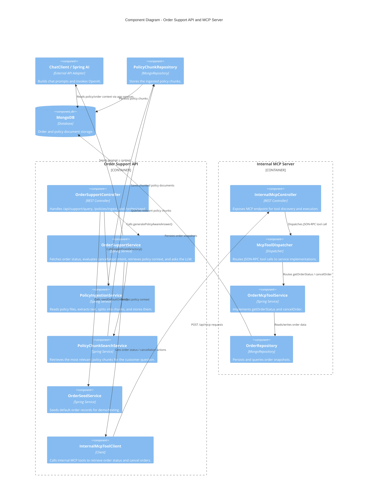

# Architecture

This document captures the system architecture of the Intelligent AI Order Support Policy Assistant using Mermaid C4 diagrams.

## 1) System Context Diagram

## 2) Container Diagram

## 3) Component Diagram

## Summary

This application follows a familiar pattern for an AI-enabled support assistant:

- a user-facing API layer
- a retrieval layer for policy documents
- a transactional layer for order operations via MCP
- an LLM reasoning layer for natural-language support
a MongoDB persistence layer for both operational and knowledge data
