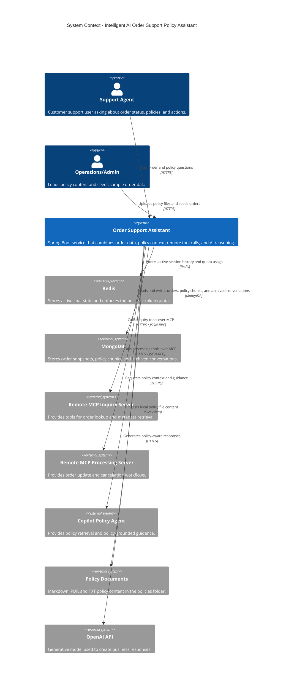
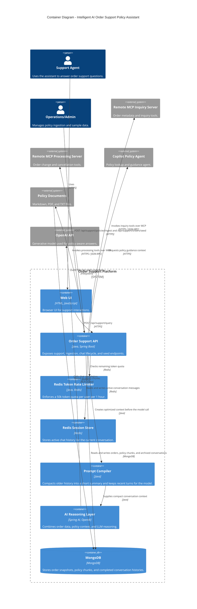
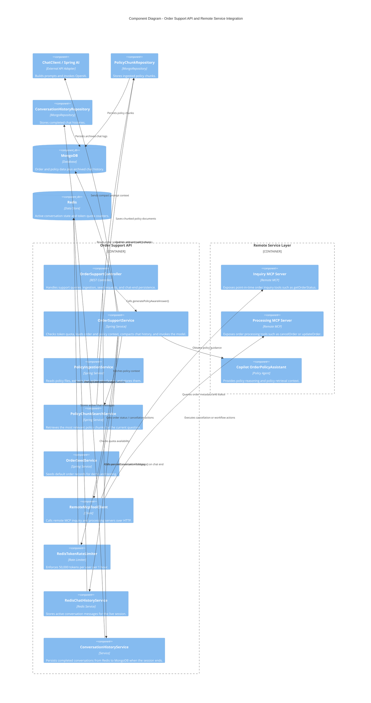

# Architecture

This document captures the architecture of the Intelligent AI Order Support Policy Assistant, including the remote MCP integrations, Redis-backed session handling, MongoDB persistence, token quota enforcement, and the compact conversation context passed to the LLM.

## 1) System Context Diagram

```mermaid
C4Context
title System Context - Intelligent AI Order Support Policy Assistant

Person(supportAgent, "Support Agent", "Customer support user asking about order status, policies, and actions.")
Person(admin, "Operations/Admin", "Loads policy content and seeds sample order data.")
System(orderSupportSystem, "Order Support Assistant", "Spring Boot service that combines order data, policy context, remote tool calls, and AI reasoning.")
System_Ext(redis, "Redis", "Stores active chat state and enforces the per-user token quota.")
System_Ext(mongo, "MongoDB", "Stores order snapshots, policy chunks, and archived conversations.")
System_Ext(mcpInquiry, "Remote MCP Inquiry Server", "Provides tools for order lookup and metadata retrieval.")
System_Ext(mcpProcessing, "Remote MCP Processing Server", "Provides order update and cancellation workflows.")
System_Ext(policyCopilot, "Copilot Policy Agent", "Provides policy retrieval and policy-grounded guidance.")
System_Ext(policyDocs, "Policy Documents", "Markdown, PDF, and TXT policy content in the policies folder.")
System_Ext(openAi, "OpenAI API", "Generative model used to create business responses.")

Rel(supportAgent, orderSupportSystem, "Asks order and policy questions", "HTTPS")
Rel(admin, orderSupportSystem, "Uploads policy files and seeds orders", "HTTPS")
Rel(orderSupportSystem, redis, "Stores active session history and quota usage", "Redis")
Rel(orderSupportSystem, mongo, "Reads and writes orders, policy chunks, and archived conversations", "MongoDB")
Rel(orderSupportSystem, mcpInquiry, "Calls inquiry tools over MCP", "HTTPS / JSON-RPC")
Rel(orderSupportSystem, mcpProcessing, "Calls processing tools over MCP", "HTTPS / JSON-RPC")
Rel(orderSupportSystem, policyCopilot, "Requests policy context and guidance", "HTTPS")
Rel(orderSupportSystem, openAi, "Generates policy-aware responses", "HTTPS")
Rel(orderSupportSystem, policyDocs, "Ingests local policy file content", "Filesystem")
```

## 2) Container Diagram

```mermaid
C4Container
title Container Diagram - Intelligent AI Order Support Policy Assistant

Person(supportAgent, "Support Agent", "Uses the assistant to answer order support questions.")
Person(admin, "Operations/Admin", "Manages policy ingestion and sample data.")

System_Boundary(c1, "Order Support Platform") {
    Container(webUi, "Web UI", "HTML, JavaScript", "Browser UI for support interactions.")
    Container(api, "Order Support API", "Java, Spring Boot", "Exposes support, ingestion, chat lifecycle, and seed endpoints.")
    Container(rateLimiter, "Redis Token Rate Limiter", "Java, Redis", "Enforces a 50k token quota per user per 1 hour.")
    Container(sessionStore, "Redis Session Store", "Redis", "Stores active chat history for the current conversation.")
    Container(promptBuilder, "Prompt Compiler", "Java", "Compacts older history into a short summary and keeps recent turns for the model.")
    Container(aiLayer, "AI Reasoning Layer", "Spring AI, OpenAI", "Combines order data, policy context, and LLM reasoning.")
    ContainerDb(mongo, "MongoDB", "MongoDB", "Stores order snapshots, policy chunks, and completed conversation histories.")
}

System_Ext(mcpInquiry, "Remote MCP Inquiry Server", "Order metadata and inquiry tools.")
System_Ext(mcpProcessing, "Remote MCP Processing Server", "Order change and cancellation tools.")
System_Ext(policyCopilot, "Copilot Policy Agent", "Policy lookup and guidance agent.")
System_Ext(policyDocs, "Policy Documents", "Markdown, PDF, and TXT files.")
System_Ext(openAi, "OpenAI API", "Generative model used for policy-aware answers.")

Rel(supportAgent, webUi, "Uses", "HTTPS")
Rel(webUi, api, "POST /api/support/query", "HTTPS")
Rel(admin, api, "POST /api/support/policies/ingest and /api/support/orders/seed", "HTTPS")
Rel(api, rateLimiter, "Checks remaining token quota", "Redis")
Rel(api, sessionStore, "Reads and writes active conversation messages", "Redis")
Rel(api, promptBuilder, "Creates optimized context before the model call", "Java")
Rel(promptBuilder, aiLayer, "Supplies compact conversation context", "Java")
Rel(aiLayer, openAi, "Calls chat completion", "HTTPS")
Rel(api, mongo, "Reads and writes orders, policy chunks, and archived conversations", "MongoDB")
Rel(api, mcpInquiry, "Invokes inquiry tools over MCP", "HTTPS / JSON-RPC")
Rel(api, mcpProcessing, "Invokes processing tools over MCP", "HTTPS / JSON-RPC")
Rel(api, policyCopilot, "Requests policy guidance context", "HTTPS")
Rel(api, policyDocs, "Loads files for policy ingestion", "Filesystem")
Rel(policyDocs, mongo, "Stored as policy chunks", "Bulk ingest")
```

## 3) Component Diagram

```mermaid
C4Component
title Component Diagram - Order Support API and Remote Service Integration

Container_Boundary(apiBoundary, "Order Support API") {
    Component(controller, "OrderSupportController", "REST Controller", "Handles support queries, ingestion, seed requests, and chat-end persistence.")
    Component(orderService, "OrderSupportService", "Spring Service", "Checks token quota, loads order and policy context, compacts chat history, and invokes the model.")
    Component(policyIngestion, "PolicyIngestionService", "Spring Service", "Reads policy files, extracts text, splits into chunks, and stores them.")
    Component(policySearch, "PolicyChunkSearchService", "Spring Service", "Retrieves the most relevant policy chunks for the current question.")
    Component(seedService, "OrderSeedService", "Spring Service", "Seeds default order records for demo and testing.")
    Component(mcpClient, "RemoteMcpToolClient", "Client", "Calls remote MCP inquiry and processing servers over HTTP.")
    Component(rateLimiter, "RedisTokenRateLimiter", "Rate Limiter", "Enforces 50,000 tokens per user per 1 hour.")
    Component(redisHistory, "RedisChatHistoryService", "Redis Service", "Stores active conversation messages for the live session.")
    Component(historyService, "ConversationHistoryService", "Service", "Persists completed conversations from Redis to MongoDB when the session ends.")
}

Container_Boundary(remoteBoundary, "Remote Service Layer") {
    Component(mcpInquiry, "Inquiry MCP Server", "Remote MCP", "Exposes point-in-time order inquiry tools such as getOrderStatus.")
    Component(mcpProcessing, "Processing MCP Server", "Remote MCP", "Exposes order processing tools such as cancelOrder or updateOrder.")
    Component(policyAgent, "Copilot OrderPolicyAssistant", "Policy Agent", "Provides policy reasoning and policy retrieval context.")
}

Component(aiAdapter, "ChatClient / Spring AI", "External API Adapter", "Builds prompts and invokes OpenAI.")
Component(policyRepo, "PolicyChunkRepository", "MongoRepository", "Stores ingested policy chunks.")
Component(historyRepo, "ConversationHistoryRepository", "MongoRepository", "Stores completed chat histories.")
ComponentDb(mongo, "MongoDB", "Database", "Order and policy data plus archived chat history.")
ComponentDb(redis, "Redis", "Data Store", "Active conversation state and token quota counters.")

Rel(controller, orderService, "Calls generatePolicyAwareAnswer()")
Rel(controller, historyService, "Calls persistConversationToMongo() on chat end")
Rel(orderService, rateLimiter, "Checks quota availability")
Rel(orderService, redisHistory, "Adds user and assistant messages")
Rel(orderService, mcpClient, "Gets order status / cancellation actions")
Rel(orderService, policySearch, "Fetches policy context")
Rel(orderService, aiAdapter, "Sends compact prompt context")
Rel(policyIngestion, policyRepo, "Saves chunked policy documents")
Rel(policySearch, policyRepo, "Queries relevant policy chunks")
Rel(mcpClient, mcpInquiry, "Queries order metadata and status")
Rel(mcpClient, mcpProcessing, "Executes cancellation or workflow actions")
Rel(orderService, policyAgent, "Obtains policy guidance")
Rel(historyService, historyRepo, "Persists completed conversations")
Rel(rateLimiter, redis, "Reads and updates token usage")
Rel(redisHistory, redis, "Stores active chat messages")
Rel(orderService, mongo, "Reads order snapshots and archived history")
Rel(policyRepo, mongo, "Persists policy chunks")
Rel(historyRepo, mongo, "Persists archived chat logs")
```

## 4) Prompt and conversation design

The model is not fed the entire raw chat history for every request. Instead, the service builds a compact conversation context before the call:

- recent messages are preserved verbatim for local continuity
- older conversation content is summarized into a short business context
- core facts such as order IDs, policy constraints, and pending confirmations are retained
- noisy or redundant turns are dropped to keep the request within the model token budget

This pattern keeps the support flow coherent across multi-turn conversations while controlling cost and latency.

## Summary

This application follows a layered AI support architecture:

- a browser-facing API layer
- a Redis-backed live session and quota layer
- a policy retrieval and reasoning layer using both local policy ingestion and a Copilot policy assistant
- remote MCP inquiry and processing services for order operations
- a prompt compaction layer to preserve context with lower token usage
- MongoDB persistence for durable operational and conversational data
